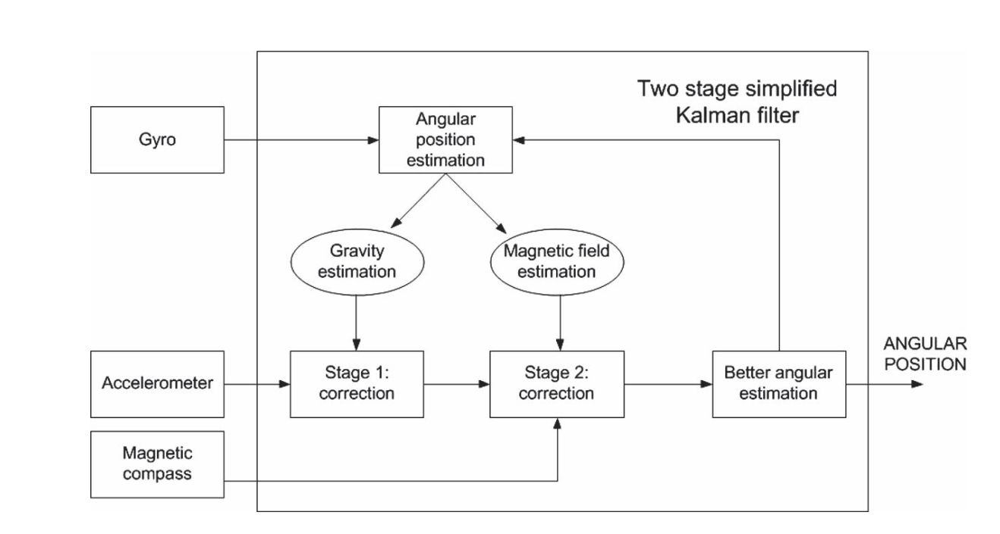

# **EKF姿态解算算法**
**EKF姿态解算算法动态响应优于原互补滤波算法响，效率更高**
## **说明**
1. 算法中使用的导航坐标系为东北天坐标系（ENU）
2. IMU为机体坐标系，前、左、上（XYZ）
3. 欧拉角的旋转顺序为：Z Y X(偏航、俯仰、滚转)
## **0.EKF姿态解算算法框架**


1. 首先使用陀螺仪数据预测出姿态角，系统模型预测做先验估计
2. 再由加速计和磁力计的测量模型的测量模型做后验估计

**状态向量**
由四元数和三轴陀螺零偏组成的7维向量

$x=\left[\begin{matrix} q_1\\q_2\\q_3\\q_4\\w_{bx}\\w_{by}\\w_{bz} \end{matrix}\right]$


## **1. 第一步：初始化欧拉角和四元数**
计算初始欧拉角，由加速计计算初始俯仰和滚转角，由磁力计计算初始偏航角，其公是如下：

$roll  = asin \frac{ay}{\sqrt{a_x^2+a_y^2+a_z^2}}$

$pitch = atan \frac{-a_x}{a_z} = atan2(-a_x,a_z)$

$yaw = atan2(m_y^n,m_x^n)$
 
 其中：

$m_x^n = m_x^bcos(p)+m_z^bsin(p)$

$m_y^n = m_x^bsin(p)sin(r) + m_y^bcos(r)-m_z^bcos(p)sin(r)$

定义：

1. $roll,pitch,yaw$分别是绕$x,y,z$轴旋转的横滚角、俯仰角、偏航角，在三角函数中简写分别为$r,p,y$
2. $m_x^n,m_y^n$分别为大地坐标系下$x,y$轴方向磁力值
3. $m_x^b,m_y^b,m_z^b$分别为机体坐标系下$x,y，z$轴方向磁力值

由欧拉角再计算初始四元数
公式为：

$q_0 = cos(\frac{x}{2})cos(\frac{y}{2})cos(\frac{z}{2}) + sin(\frac{x}{2})sin(\frac{y}{2})sin(\frac{z}{2})$

$q_1 = sin(\frac{x}{2})cos(\frac{y}{2})cos(\frac{z}{2}) - cos(\frac{x}{2})sin(\frac{y}{2})sin(\frac{z}{2})$

$q_2 = cos(\frac{x}{2})sin(\frac{y}{2})cos(\frac{z}{2}) + sin(\frac{x}{2})cos(\frac{y}{2})sin(\frac{z}{2})$

$q_3= cos(\frac{x}{2})cos(\frac{y}{2})sin(\frac{z}{2}) - sin(\frac{x}{2})sin(\frac{y}{2})cos(\frac{z}{2})$

其中：
$x,y,z$分别是绕$x,y,z$旋转角度

## **2.第二步：初始化噪声**
初始化过程噪声协方差矩阵Q，观测噪声协方差矩阵R,假设各轴之间的噪声相互独立，其协方差矩阵可表示为：

$Q = \left[\begin{matrix} Q_{qn}&0 \\ 0&Q_{bn} \end{matrix}\right]$

$R = \left[\begin{matrix} w_{ax}&0&0 \\ 0&w_{ay}&0\\0&0&w_{az} \end{matrix}\right]$

其中：$Q_{qn}$为四元数过程噪声噪声，$Q_{bn}$为陀螺仪三轴偏置值的噪声（不是测量噪声）,$w_a$为加速计测量噪声

**注意：$Q_{qn}$四元数过程噪声四个元素不是相互独立的**

下面分析$Q_{qn}$该如何表示：

1. 可以认为陀螺仪三轴是相互独立的，同时也可以认为陀螺仪是最初噪声引入者，而四元数只是中间过程变量，所以可以考虑使用陀螺仪的噪声来表示四元数的过程噪声；
2. 补充一下正态分布的知识：假设$X_1,X_2$是符合正态分布的概率密度函数$X_1=N(\mu_1,\sigma_1^2),X_2=N(\mu_2,\sigma_2^2)$则满足以下关系：
> $tX_1=N(t\mu_1,t^2\sigma_1^2)$式中t是常数

> 当$X_1,X_2$相互独立时：$X_1+X_2=N(\mu_1+\mu_2,\sigma_1^2 + \sigma_2^2)$
3. 根据四元数微分方程离散后的公式
$
\left[ 
\begin{matrix}q_{0|k}\\ q_{1|k}\\ q_{2|k}\\ q_{3|k}
\end{matrix}
\right]= \frac{1}{2}\left[\begin{matrix}2 &-w_xT &-w_yT &-w_zT\\
w_xT &2&w_zT&-w_yT\\
w_yT&-w_zT&2&w_xT\\
w_zT&w_yT&-w_xT&2 
\end{matrix}\right]
\left[ 
\begin{matrix}q_{0|k-1}\\q_{1|k-1}\\q_{2|k-1}\\q_{3|k-1}
\end{matrix} \right]$

以第一行$q_0$为例，将陀螺噪声带入上式可以满足以下关系：

$ \displaystyle\begin{cases}
q_{0|k} = N(\mu_{q0},\sigma_0^2)\\
\mu_{q0} = \frac{1}{2}(2q_{0|k-1} - g_xq_{1|k-1}T -g_yq_{2|k-1}T-g_zq_{3|k-1}T)\\
\sigma_0^2 = (\frac{T}{2})^2(\sigma_x^2q_{1|k-1}^2 + \sigma_y^2q_{2|k-1}^2+\sigma_z^2q_{3|k-1}^2)
\end{cases} $
式中$g_x,g_y,g_z,\sigma_x,\sigma_y,\sigma_z$分别是三轴陀螺的期望和方差。

综上所述可以写出四元数预测过程的噪声公式：
$Q_{qn} = \left[\begin{matrix}
Q_1&0&0&0\\
0&Q_2&0&0\\ 
0&0&Q_3&0\\
0&0&0&Q_4
\end{matrix}\right]$
式中：
$\begin{cases} 
Q_1=\sigma_0^2 = (\frac{T}{2})^2(\sigma_x^2q_{1|k-1}^2 + \sigma_y^2q_{2|k-1}^2+\sigma_z^2q_{3|k-1}^2)\\
Q_2=\sigma_1^2 = (\frac{T}{2})^2(\sigma_x^2q_{0|k-1}^2 + \sigma_z^2q_{2|k-1}^2+\sigma_y^2q_{3|k-1}^2)\\
Q_3=\sigma_2^2 = (\frac{T}{2})^2(\sigma_y^2q_{0|k-1}^2 + \sigma_z^2q_{1|k-1}^2+\sigma_x^2q_{3|k-1}^2)\\
Q_4=\sigma_3^2 = (\frac{T}{2})^2(\sigma_z^2q_{0|k-1}^2 + \sigma_y^2q_{1|k-1}^2+\sigma_x^2q_{2|k-1}^2)
\end{cases}$


## **3.第三步：先验过程由系统方程求状态预测值及其协方差**

状态转移方程主要用到四元数微分方程：

$ 
\dot{q}_n^b = \frac{1}{2}\Omega_{nb}^n q_n^b$

其中：

$\Omega_{nb}^n = \left[\begin{matrix}0 &-w_x &-w_y &-w_z\\
w_x &0&w_z&-w_y\\
w_y&-w_z&0&w_x\\
w_z&w_y&-w_x&0 
\end{matrix}\right] $

$
\left[ 
\begin{matrix}\dot{q}_0\\ \dot{q}_1\\ \dot{q}_2\\ \dot{q}_3
\end{matrix}
\right]= \frac{1}{2}\left[\begin{matrix}0 &-w_x &-w_y &-w_z\\
w_x &0&w_z&-w_y\\
w_y&-w_z&0&w_x\\
w_z&w_y&-w_x&0 
\end{matrix}\right]
\left[ 
\begin{matrix}q_0\\q_1\\q_2\\q_3
\end{matrix} \right]
$

以上公式$q_n^b$是从导航坐标系到载体坐标系的四元数，上面四元数微分方程是在连续域中的表达式，使用卡尔曼滤波器的时候要转换为离散域。

系统方程预测更新的最新状态的状态转移方程为：

$\hat{x}_k^- = A_k\hat{x}_{k-1} + B_ku_k$
其中：$\hat{x}_{k-1}$是上一时刻的最终估计值

四元数微分方程可以表示为：

$\dot{q}_n^b = \displaystyle \lim_{T \rightarrow 0} \frac{q_n^b(t+T)-q_n^b(t)}{T} = A_{TC} q_n^b(t)$ 

$q_b^n(t+T)=q_n^b(t) + A_{TC}q_n^b(t)T= (I+\displaystyle\frac{1}{2}\Omega_{nb}^nT )$

$A_k^1 = (I+A_{TC}T) = (I+\displaystyle\frac{1}{2}\Omega_{nb}^nT )$


$A_k^1 = \displaystyle\frac{1}{2} \left[\begin{matrix} 2& -T(w_x-w_{bx})& -T(w_y-w_{by})&-T(w_z-w_{bz}) \\ 
T(w_x-w_{bx})&2&T(w_z-w_{bz})&-T(w_y-w_{by})\\
T(w_y-w_{by})&-T(w_z-w_{bz})&2&T(w_x-w_{bx})\\
T(w_z-w_{bz})&T(w_y-w_{by})&-T(w_x-w_{bx})&2
\end{matrix}\right]$

$A_k^1$为状态状态转移矩阵的一部分，因为设定的状态变量为四元数+陀螺偏置，是一个7维矩阵

最终的状态转移矩阵为：
$\left[\begin{matrix}  q_{k+1}\\ w_{bk+1}\end{matrix}\right]  = \left[\begin{matrix}(I+\displaystyle\frac{1}{2}\Omega_{nb}^nT ) & 0 \\0 & I\end{matrix}\right] 
\left[\begin{matrix}  q_{k}\\ w_{bk}\end{matrix}\right] $

**注意：需要对状态更新后的四元数进行归一化处理**

设$\left[\begin{matrix}(I+\displaystyle\frac{1}{2}\Omega_{nb}^nT ) & 0 \\0 & I\end{matrix}\right]\left[\begin{matrix}  q_{k}\\ w_{bk}\end{matrix}\right]=g(x_k),x_k = \left[\begin{matrix}  q_{k}\\ w_{bk}\end{matrix}\right]$

则状态转移方程的雅克比矩阵求解如下：

$G_k = \displaystyle\frac{\displaystyle\partial g(x_k)}{\displaystyle\partial x_k}$

使用MATLAB字符运算求解的结果为：

$G_k =\left[\begin{matrix}(I+\displaystyle\frac{1}{2}\Omega_{nb}^nT ) & \displaystyle\frac{1}{2}T{\left[\begin{matrix} q_1&q_2&q_3 \\-q_0&q_3&-q_2\\-q_3&-q_0&q_1\\q_2&-q_1&-q_0  \end{matrix} \right] }_{4×3} \\0 & I_{3×3}\end{matrix}\right]$

求解$G_k$雅克比矩阵的MATLAB程序如下：
```MATLAB
syms q0  
syms q1   
syms q2  
syms q3
syms w_x  
syms w_y  
syms w_z
syms wb_x  
syms wb_y  
syms wb_z
syms T
 
q_k = [q0;q1;q2;q3;wb_x;wb_y;wb_z];
gyro_x_bias = w_x-wb_x;
gyro_y_bias = w_y-wb_y;
gyro_z_bias = w_z-wb_z;
 
A_11=[1,-(T/2)*gyro_x_bias,-(T/2)*gyro_y_bias,-(T/2)*gyro_z_bias;
        (T/2)*gyro_x_bias,1,(T/2)*gyro_z_bias,-(T/2)*gyro_y_bias;
        (T/2)*gyro_y_bias,-(T/2)*gyro_z_bias,1,(T/2)*gyro_x_bias;
        (T/2)*gyro_z_bias,(T/2)*gyro_y_bias,-(T/2)*gyro_x_bias,1];
    
A_12=[0,0,0;
      0,0,0;
      0,0,0;
      0,0,0];   %4*3
A_21=[0,0,0,0;
      0,0,0,0;
      0,0,0,0]; %3*4
A_22=[1,0,0;
      0,1,0;
      0,0,1];   %3*3
A=[A_11,A_12;A_21,A_22]; 
q=A*q_k;
q_dif=[diff(q,q0),diff(q,q1),diff(q,q2),diff(q,q3),diff(q,wb_x),diff(q,wb_y),diff(q,wb_z)]
```
更新先验过程预测值的协方差矩阵，第二个公式：

$
P_k^- = G_kP_{k-1}G_k^T + Q_{k-1}$

## **第四步.计算测量方程**
测量方程:$Z_k= Hx_k+v_k$ 即由状态变量反推测量值,本算法中，$Z=\left[\begin{matrix} a_x\\a_y\\a_z\\ \end{matrix}\right]$，由于磁力计容易受到干扰，所以不用磁力计修正横滚和俯仰角，只用于修正偏航角，而偏航角修正在加速计修正后的结果再针对偏航角进行修正。

首先求加速计的测量方程，加速计的单位为g，计算重力加速度g在机载坐标系下的测量值，将计算过程如下：

$R_n^b = \left[\begin{matrix} 1-2(q_2^2+q_3^2)&2(q_1q_2-q_0q_3)&2(q_0q_2+q_1q_3)\\
2(q_1q_2+q_0q_3)&1-2(q_1^2+q_3^2)&2(q_2q_3-q_0q_1)\\
2(q_1q_3-q_0q_2)&2(q_0q_1+q_2q_3)&1-2(q_1^2+q_2^2)
\end{matrix}\right]$

\left[\begin{matrix}  \end{matrix}\right]

$h_1(q_k)=R_b^n \left[\begin{matrix} 0\\0\\1 \end{matrix}\right] = \left[\begin{matrix} 2q_1q_3-2q_0q_2\\2q_2q_3+2q_0q_1\\q_0^2-q_1^2-q_2^2+q_3^2 \end{matrix}\right]$

实际上，只有载体在只受重力加速度影响的时候才能估算姿态角，所以加速度的测量方程只有在运动不剧烈的时候才满足，所以有一种策略，根据加速度判断运动的剧烈程度后自适应调节测量方程加速度项的测量噪声。

设加速计的三轴测量数据分别为$a_x^b,a_y^b,a_z^b$加速度的测量方程即总的测量方程如下（式中加速度数据要进行归一化处理）：

**注意:测量方程中用的状态变量是由系统方程预测后的k时刻的值**

$h_k(\hat{x}_k^-)=\left[\begin{matrix} a_x^b\\a_y^b \\a_z^b\end{matrix}\right] = \left[\begin{matrix} 2q_1q_3-2q_0q_2\\2q_2q_3+2q_0q_1\\q_0^2-q_1^2-q_2^2+q_3^2 \end{matrix}\right] + w_a$
式中：$w_a$为加速计的测量噪声

求得加速计测量方程的雅克比矩阵如下：

$H_k = \displaystyle\frac{\partial h(q_k)}{\partial x_k} =\left[\begin{matrix}-2q_2&2q_3&-2q_0&2q_1&0&0&0\\ 2q_1&2q_0&2q_3&2q_2&0&0&0\\
2q_0&-2q_1&-2q_2&2q_3&0&0&0  \end{matrix}\right] $

使用MATLAB求测量方程雅克比矩阵程序如下

```MATLAB
syms q0  
syms q1   
syms q2  
syms q3
syms w_bx
syms w_by
syms w_bz
 
q = [q0;q1;q2;q3];
matrix_n2b = quatToRotMat(q);
matrix_b2n = matrix_n2b';
acce_n = [0;0;1]; %加速度计数据在导航坐标系下的投影，注意加速度计单位为g
acce_b = matrix_b2n*acce_n; %加速度计数据在载体坐标系下的投影
acce_dif=[diff(acce_b,q0),diff(acce_b,q1),diff(acce_b,q2),diff(acce_b,q3),diff(acce_b,w_bx),diff(acce_b,w_by),diff(acce_b,w_bz)] %求雅克比矩阵

%求取的结果意思是取实部即可
% 结果
% acce_dif =
% [ -2*(q2),  2*(q3), -2*(q0), 2*(q1)]
% [  2*(q1),  2*(q0),  2*(q3), 2*(q2)]
% [  2*(q0), -2*(q1), -2*(q2), 2*(q3)]
 
% 四元数转旋转矩阵函数
function R = quatToRotMat(q)
R = [ q(1)*q(1)+q(2)*q(2)-q(3)*q(3)-q(4)*q(4)   2*(q(2)*q(3)-q(1)*q(4))   2 *(q(2)*q(4)+q(1)*q(3));
    2*(q(2)*q(3)+q(1)*q(4))        q(1)*q(1)+q(3)*q(3)-q(2)*q(2)-q(4)*q(4)    2*(q(3)*q(4)-q(1)*q(2));
    2*(q(2)*q(4)-q(1)*q(3))     2*(q(3)*q(4)+q(1)*q(2))        q(1)*q(1)+q(4)*q(4)-q(2)*q(2)-q(3)*q(3)];%cnb
end
```


## **第五步：计算卡尔曼增益**

$
K_k=\displaystyle \frac{P_k^-H_k^T}{H_kP_k^-H_k^T +R}$

## **第六步：更新估计值**

$
\hat{x}_k = \hat{x}_k^- + K_k(Z_k - h_k(\hat{x}_k^-))$

## **第七步：更新最新估计值的协方差矩阵**
$
P_k=(I-K_kH_k)P_k^-$

## **第八步：将四元数转为欧拉角**

设偏航、俯仰、滚转的角度分别是z,y,x

公式为：

$roll= atan \frac{2(q_0q_1+q_2q_3)}{1-2(q_1^2+q_2^2)}=atan2(2(q_0q_1+q_2q_3),1-2(q_1^2+q_2^2))$

$pitch = asin(2(q_0q_2-q_3q_1))$

$yaw=atan \frac{2(q_0q_3+q_1q_2}{1-2(q_2^2+q_3^2)}=atan2(2(q_0q_3+q_1q_2),1-2(q_2^2+q_3^2))$

## **第九步：根据磁力计值修正偏航角**
### **方法一、使用卡尔曼滤波**
特点：修正速度快，动态特性好，单轴本质就是互补滤波

设磁力计测量出的航向角为yaw_mag,置信度为yaw_k,即为权重
1. 由磁力计数据和更新的四元数数据，求出由磁力计测出的航向角，测量值

$yaw_{mag} = atan2(m_y^n,m_x^n)$  注意：要修正磁偏角后才能使用
 
 其中：

$m_x^n = m_x^bcos(p)+m_z^bsin(p)$

$m_y^n = m_x^bsin(p)sin(r) + m_y^bcos(r)-m_z^bcos(p)sin(r)$

2. 修正航向角，获得k时刻的估计值,公式为：

$yaw_k = yaw_k^- + K_{mag}*(yaw_{mag} - yaw_k^-) $

式中$yaw_k^-$为上面陀螺仪更新后获得的偏航角预测值

实际为单轴Kalman，因为是线性的，所以不用EKF

3. 将修正后最新状态的偏航角转化为四元数，并更新状态向量

### **方法二、使用PI控制器**
特点：修正过程平滑，但速度较慢，参数不对有发散的风险


