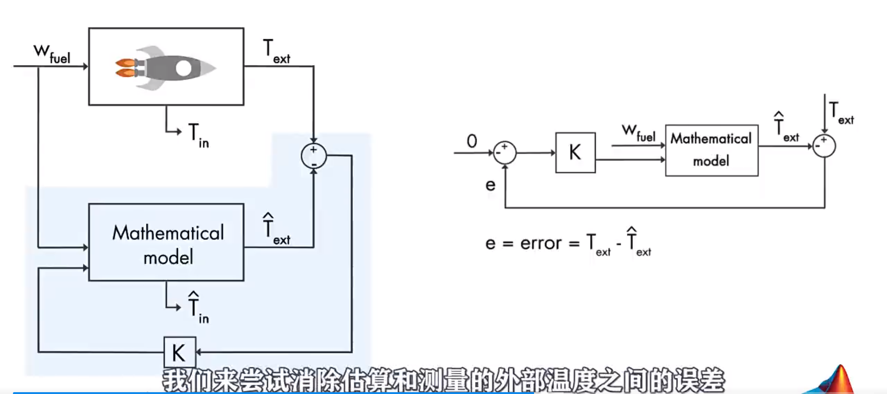
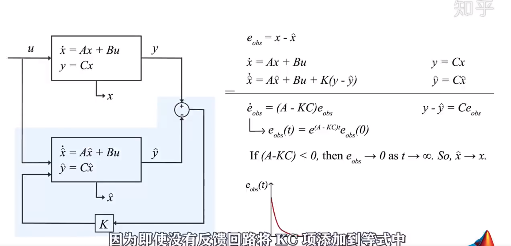
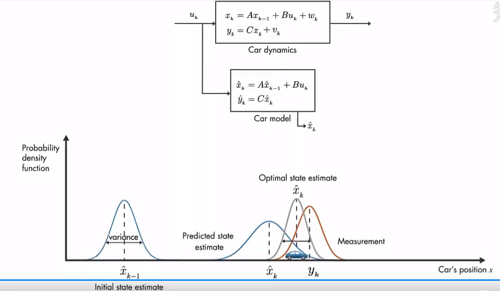
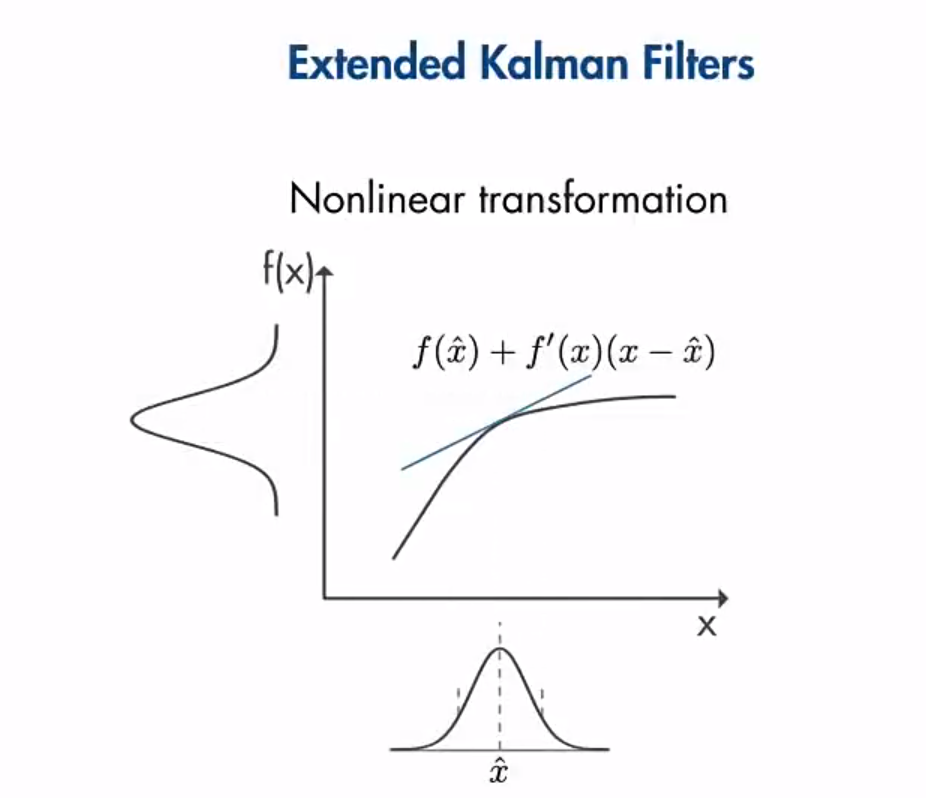

# EKF拓展卡尔曼滤波学习笔记
**参考教程链接：**
[国外卡尔曼滤波器教程](https://www.zhihu.com/question/23971601)

[基于EKF姿态解算](https://zhuanlan.zhihu.com/p/103617763)

## **基础知识**
### **动态系统状态空间模型**
&emsp;通过状态空间方法来描述动态系统方法，动态系统的状态由<u>**一阶微分方程**</u>来描述，所以如果要分析某个状态变量的动态特性，列出该状态变量的一阶微分方程，通过分析一阶微分方程来获得该状态变量的动态特性。

&emsp;一个有p个输入、q个输出及n个状态变数的线性系统，可以用以下的状态空间表示法来表示：

$\dot{X}(t)=A*X(t)+B*u(t)$

$ Y(t)= C*X(t) + D*u(t)$

其中：

&emsp;$X(\cdot)$称为状态空间向量，$X(t)\in \mathbb{R^n}$

&emsp;$\dot{X}(\cdot)$ 定义为$\frac{d}{dt}X(t)$

&emsp;$Y(\cdot)$为输出向量，$Y(t)\in \mathbb{R^q}$

&emsp;$u(\cdot)$为输入向量（或是控制向量），$u(t)\in \mathbb{R^p}$

&emsp;$A(\cdot)$为状态矩阵，$A(\cdot)$是个$n\times n$矩阵

&emsp;$B(\cdot)$为输入矩阵，$B(\cdot)$是个$n\times p$矩阵

&emsp;$C(\cdot)$为输出矩阵，$C(\cdot)$是个$q\times n$矩阵

&emsp;$D(\cdot)$为前馈矩阵，$D(\cdot)$是个$q\times p$矩阵，若系统没有直接从输入到输出的路径，则此矩阵为零矩阵

## **一.卡尔曼滤波器简介**

* ## 卡尔曼滤波主要应用在两方面：
1. 用于优化估算一些无法直接测量但是可以间接测量的量
2. 用于受误差影响的传感器测量值中估算出系统状态

**问题**：一个系统有变量1和变量2，变量1可直接测得，变量2无法直接测量，如何估计变量2？

**解决问题思路**：通过系统数学模型，根据其他条件可以估算出变量1和变量2，由于变量1可直接测量，所以增加一个反馈控制器K，使变量1实际测量的值与系统模型估计出的值偏差趋于0（系统模型估计值接近直接测量值），此时可认为由系统模型估计出的变量2的值具有较高可信度。

* ## 说明
1. 估计：为目标变量滤波后的值
2. 预测：为目标变量通过系统模型计算出的值
3. 测量：为可直接测量的值

* ## 状态观察器
1. 通过系统数学模型，根据间接测量值得到目标的预测值，和由传感器获得的测量值
2. 通过反馈控制器，将预测值和测量值的差尽可能的缩小为0
3. 状态观察器，由观测器（间接测量值）与预测值（间接变量）偏差，通过控制器K反馈到系统模型获得目标测量值；这部分系统成为状态观测器，**此时的问题是如何选择控制器增益K，使得测量值和估计值最小**

状态观测器模型如下图：

$e_{obs} = x - \hat{x}$ &emsp;&emsp;&emsp;估计值与预测值的偏差

$\dot{x} = Ax + Bu$ $\qquad y=Cx$  &emsp;&emsp;&emsp; 实际系统模型表达式

$\dot{\hat{x}} = A\hat{x}+Bu + K(y - \hat{y})$ $\qquad\hat{y} = C\hat{x}$  &emsp;&emsp;&emsp; 估计系统模型加反馈结构后的系统表达式

$y - \hat{y} = Ce_{obs}$ &emsp;&emsp;&emsp;直接测量值与系统模型预测的测量值的偏差

$\Rightarrow$ $\dot{e}_{obs} = \dot{x}-\dot{\hat{x}} = (A-KC){e}_{obs}$ &emsp;&emsp;&emsp;获取关于$e_{obs}$ 的一阶微分方程

$\Rightarrow$ $ e_{obs}(t) = e^{(A-KC)t} \cdot e_{obs}(0)$  &emsp;&emsp;&emsp;求取一阶微分方程解

分析$e_{obs}$ 的一阶微分方程动态特性：

如果$(A-KC)<0$,当$t\rightarrow{\infty}$ 时 $ e_{obs}\rightarrow{0}$，即 $\hat{x}\rightarrow{x}$

其中：如果指数项没有KC项，误差函数也可能会收敛，但是对于不清楚系统模型的情况，无法确定A的值，对于其误差函数收敛速率无能为力，而增加反馈控制器KKC项的意义在于，我们可以通过调节KC项的值来控制误差函数的收敛速率，以确保更快的消除偏差，则估计得状态$\hat{x}$ 收敛到真实状态$x$的速度越快，而选择增益K的最佳方法，就是使用卡尔曼滤波器

* ## 最佳状态观测器原理->卡尔曼滤波算法原理

1. 图中测量方程中$v_k$ 为测量误差，是一个随机变量，表示实际测量过程引入了噪声
2. 图中过程方程中$w_k$ 为过程误差，也可认为是一个随机变量，表示系统在实际情况受到没有被系统模型表示出来的扰动（如：小车运动的数学模型中，没有描述出风吹振动等作用的，而实际小车运动过程中是一直受到这些扰动的，将这些扰动定义为过程误差）
3. 测量误差及过程误差不遵循确定的规律，但是可以通过概率的方法来描述其平均属性，假设$v~N(0,R)$v是一个服从零均值，协方差为R的高斯分布，$w~N(0,Q)$w是一个服从零均值，协方差为Q的高斯分布，方差表示不确定性；
4. 图中通过概率分布函数来表示卡尔曼滤波器的原理
>1. 首先在k-1时刻，实际值可以是估计值$\hat{x}_{k-1}$ 附近的任何位置，通过该位置的概率密度函数来描述这种不确定性
>2. 在k时刻，系统的预测值由于过程误差的影响不确定性会大于k-1时刻的估计值，图中用$\hat{x}_{k}$ 附近，此时测量值$y_k$ 及误差测量的不确定性用图中 $y_k$ 位置的概率密度函数描述
>3. 此时估计k时刻目标值的最佳方法是将两部分信息结合起来，通过两个概率函数相乘来完成，得到图中灰色概率密度函数，以此来获得k时刻最佳估计值，这就是卡尔曼滤波器的背后原理

* ## 卡尔曼滤波算法
&emsp;上面说的预测值和测量值两个概率密度函数的乘法与离散卡尔曼滤波器方程有关。
    
先验估值：

$
\hat{x}_k = \underbrace{A\hat{x}_{k-1}+Bu_k}_{\hat{x}_k^-:k时刻预测值} + K_k(y_k - C(A\hat{x}_{k-1} + Bu_k))$

将$\hat{x}_k^-$ 带入式中获得：

$
\hat{x}_k = \hat{x}_k^- + K_k(y_k - C\hat{x}_k^-)$

&emsp;第一部分是预测当前状态值，通过前一时刻的估计值以及当前时刻的输入，系统模型的预测值用$\hat{x}_k^-$来表示

&emsp;第二部分是更新值，通过将测量值带入方程来更新预估值（实际就是增加一个K控制器）

**我们将结果$\hat{x}_k$称为先验估值**

**卡尔曼滤波方程：**

**两个预测方程：**

k时刻系统模型预测值方程：

$
\hat{x}_k^-=A\hat{x}_{k-1}+Bu_k$

k时刻系统模型预测值的协方差矩阵P方程：

$
\hat{P}_k^-=AP_{k-1}A^T+Q$ 

&emsp;其中$\hat{P}_k^-$用于表示预测状态的不确定性度量，由k-1
时刻的预估值$\hat{x}_{k-1}$ 的不确定性$P_{k-1}$ 和过程误差Q一起共同影响

&emsp;在算法开始时$\hat{x}_{k-1}\quad P_{k-1}$ 为预设的初始值

**三个更新方程**
&emsp;将预测步骤中由系统模型计算的先验预测值和其误差协方差$\hat{x}_k^-\quad P_k^-$ ，带入更新方程中获得k时刻的估计值及其误差协方差$\hat{x}_k \quad P_k$ 

首先调整卡尔曼增益K，使更新后的估计值的误差协方差最小，卡尔曼增益更新公式：
$K_k=\frac{P_k^- C^T}{CP_k
^- C^T + R}$

更新k时刻估计值：

$
\hat{x}_k = \hat{x}_k^- + K_k(y_k - C\hat{x}_k^-)$

更新k时刻估计值误差的协方差矩阵：

$
P_k=(I-K_kC)P_k^-$

对于卡尔曼增益决定了预测值和测量值在最终的估计值中所占的权重，测量值的误差R很小，则更加取信于测量值,反之则更加取信于模型计算的预测值

* ## 拓展卡尔曼滤波算法（EKF)
线性系统的状态空间模型：

$x_k=Ax_{k-1}+Bu_k+w_k$

$y_k=Cx_k+v_k$

线性系统中，输入向量$u_k$与状态向量之间的关系是直接叠加的关系

非线性系统的状态空间模型：

$x_k=f(x_{k-1},u_k)+w_k$

$y_k=g(x_k)+v_k$

&emsp;非线性系统中，输入向量与状态变量之间是非线性函数关系，而非简单的叠加关系，这时候误差可能被非线性地加入系统

&emsp;而卡尔曼滤波器只是针对于线性系统，不能适用于非线性系统，因为具有高斯分布的变量经过非线性地函数转换后的误差不符合高斯分布

&emsp;**EKF算法实现原理：**
将非线性函数在当前估算状态的平均值附近进行线性化，在每一步计算中都对非线性函数进行线性化

1. 系统模型：

$x_k=f(x_{k-1},u_k)+w_k$

$y_k=g(x_k)+v_k$

2. 计算雅克比矩阵：

$F = \frac{\partial{f}}{\partial{x}}|_{\hat{x}_{k-1},u_k}$

$G = \frac{\partial{g}}{\partial{x}}|_{\hat{x}_k}$

3. 线性化后系统:

$\Delta x_k \approx F \Delta x_{k-1} +w_k$

$\Delta y_k \approx G \Delta x_k +v_k$

&emsp;将计算后得到的雅克比矩阵用于更新卡尔曼滤波器算法的状态

**EKF算法缺点**
1. 由于复杂的导数计算，可能难以解析方式计算出雅克比矩阵
2. 以数值方式计算他们则可能需要更高的计算成本
3. EKF不适用于不连续系统的模型
4. 对于高度非线性系统的线性化不好 

