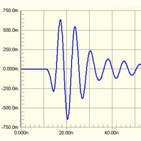

# MarkDown教程

## 一.无序列表
*无序列表1

*无序列表2
    
    *无序列表2.1
      列表嵌套前面加四个空格
    *无序列表2.2
    
## 二.有序列表
1. （按空格）有序列表1
2. （按空格）有序列表2

## 三.标题
前面#（空格）为一级标题 直到######六级标题

## 四.分割线
使用方法：***或___
***
___

## 五.段落格式
*我是斜字体*

**我是粗字体**

***粗斜体文本*** 

删除线，文字两端加~~

~~这是删除线~~

<u>带下划线效果</u>

假设注明脚注用法[^脚注用法]
[^脚注用法]:中括号加^

## 六.添加注释
>注释一段话
>添加引用内容

## 七.网页链接
[Markdown基本操作教程](https://www.jianshu.com/p/228b648734d6)
## 八.写代码
使用方法：英文输入法下 三个点``` ``` 数字1键前面的那个点，后面可以指定语言，也可以不指定

```javascript
$(document).ready(function () {
    alert('RUNOOB');
});
```
```
void main(void)
{
}
```
## 九.区块
区块使用列表实例：
>区块中使用列表
>1. 第一项
>2. 第二项
>> + 第一项 **<u>空格需是在英文输入法下</u>**
>> + 第二项


列表中使用区块
* 第一项
    >第一项：$\color{red}{空格需是在英文输入法下}$
   
## 十.插入图片
开头! 后面跟中括号[] 后面小括号再放地址，相对路径和网址都行



## 十一.表格
制作表格使用'|'来分隔不同的单元格，使用'-'来分隔表头和其他行

制作表格使用'|'来分隔不同的单元格，使用'-'来分隔表头和其他行
左对齐:-、右对齐 -:及居中:-:通过分隔符来设定 

|表头|表头|
|:---:|:---:|
|单元格|单元格|
|单元格|单元格|


# 数学公式
[数学公式语法教程链接](https://www.jianshu.com/p/e74eb43960a1)

$$\frac{d}{dx}e^{ax}=ae^{ax}\quad \sum_{i=1}^{n}{(X_i - \overline{X})^2}$$

$$\frac{\partial^2 u}{\partial z^2}$$

## 一.行内与独行

1. 行内公式：将公式插入到本行内，符号\$公式内容$,如：$x+y=z$
2. 独行公式：将公式插入到新的一行内，并且居中，符号：\$$公式内容\$$, 如：$$x+y=z$$
## 二.上标、下标与组合
1. 上标符号：^，如：$x^4$
2. 下标符号：_， 如：$x_0$
3. 组合符号：{}，如：${X_{10}}^2$
## 三.格式
1. 汉字形式，符号：{},如：$
V_{初始}$
2. 下划线符号：\underline,如：$\underline{x+y}$
3. 标签符号：\tag{数字}，如：\tag{10}$
4. 上大括号符号：\overbrace{算式}，如：$\overbrace{a+b+c+d}^{3.0}$
5. 下大括号符号：\underbrace{算式}，如：$a+\underbrace{b+c}_{1.0}+d$
6. 上位符号：\stacrel{上位符号}{基位符号}，如：$\vec{x}\stackrel{\mathrm{def}}{=}{x_1,\dots,x_n}$

## 四.占位符
1. 两个quad空格符号：\qquad，如：$x\qquad y$
2. quad空格符号：\quad，如：$x\quad y$
3. 大空格符号：\，如：$x \ y$
4. 中空格符号： \：，如：$x\:y$
5. 小空格符号： \,，如：$x \, y$
6. 紧贴符号：\!，如：$x\!y$

## 五.定界符与组合
1. 括号，符号：（）,\big( \big)，\Big( \Big) , \bigg( \bigg), Bigg( \Bigg)如：$（）,\big(\big) ,\Big(\Big), \bigg(\bigg) ,\Bigg(\Bigg)$
2. 中括号符号：[]，如：$[x+y]$
3. 大括号符号：\{\}，如：$\{x+y\}$
4. 自适应括号：\left(  \right)，如：$\left(x\right)$,$\left(x {yz}\right)$
5. 组合公式1符号：{上位公式 \choose 下位公式}，如：${n+1 \choose k} = {n \choose k} +{n \choose k-1}$
6. 组合公式2符号：{上位公式 \atop 下位公式}，如：$\sum_{k_0,k_1,\ldots>0 \atop k_0+k_1+\cdots=n}A_{k_0}A_{k_1}\cdots$

## 六.四则运算
1. 加法运算符号：+，如：$x+y=z$
2. 减法运算符号：-，如：$x-y=z$
3. 加减运算符号：\pm，如：$x\pm y=z$
4. 减加运算符号：\mp，如：$x\mp y=z$
5. 叉乘运算符号：\times，如：$x\times y=z$
6. 点乘运算符号：\cdot，如：$x\cdot y=z$
7. 星乘运算符号：\ast，如：$x\ast y=z$
8. 除法运算符号：\div，如：$x\div y=z$
9. 斜除法符号：/，如：$x/y=z$
10. 分式表示符号1：\frac{分子}{分母}，如：$\frac{x+y}{y+z}$
11. 分式表示符号2：{分子}\over{分母}，如：${x+y}\over{y+z}$
12. 绝对值符号：||，如：$|x+y|$

## 七.高级运算
1. 平均数运算符号：\overline{算式}，如：$\overline{xyz}$
2. 开二次方运算符号：\sqrt，如:$\sqrt x$
3. 开方运算符号：\sqrt[开方数]{被开方数}如:$\sqrt[3]{x+y}$
4. 对数运算符号：\log，如：$\log(x)$
5. 极限运算符号：\lim，如：$\lim^{x\to \infty}_{y\to 0}{\frac{x}{y}} $
6. 极限运算符号：\displaystyle \lim，如：$\displaystyle\lim^{x\to \infty}_{y\to 0}{\frac{x}{y}} $
7. 求和运算符号：\sum，如：$\sum^{x \to \infty}_{y \to 0}{\frac{x}{y}}$
8. 求和运算符号：\displaystyle\sum，如：$\displaystyle\sum^{x \to \infty}_{y \to 0}{\frac{x}{y}}$
9. 积分运算符号：\int，如：$\int^{\infty}_{0} {xdx}$
10. 积分运算符号：\displaystyle\int，如：$\displaystyle\int^{\infty}_{0} {xdx}$
11. 偏微分运算符号：\partial，如：$\frac{\partial x}{\partial y}$
12. 矩阵表示符号：\begin{matrix} \end{matrix}，如：$\left[\begin{matrix} 1 & 2 & 3\\ 1 & w_1 & 0  \end{matrix} \right]$

## 八.数学符号
1. 无穷符号：\infty，如：$\infty$
2. 虚数i符号：\imath，如：$\imath$
3. 虚数j符号：\jmath，如：$\jmath$
4. 数学符号：\hat{a}，如：$\hat{a}$
5. 数学符号：\check{a}，如：$\check{a}$
6. 数学符号：\breve{a}，如：$\breve{a}$
7. 数学符号：\tilde{a}，如：$\tilde{a}$
8. 数学符号：\bar{a}，如：$\bar{a}$
9. 数学符号：\acute{a}，如：$\acute{a}$
10. 数学符号：\grave{a}，如：$\grave{a}$
11. 数学符号：\mathring{a}，如：$\mathring{a}$
12. 矢量符号：\vec{a}，如：$\vec{a}$
13. 一阶导数符号：\dot{a}，如：$\dot{a}$
14. 二阶导数符号：\ddot{a}，如：$\ddot{a}$
15. 上箭头符号：\uparrow{a}，如：$\uparrow{a}$
16. 双上箭头符号：\Uparrow{a}，如：$\Uparrow{a}$
17. 下箭头符号：\downarrow{a}，如：$\downarrow{a}$
18. 双下箭头符号：\Downarrow{a}，如：$\Downarrow{a}$
19. 左箭头符号：\leftarrow{a}，如：$\leftarrow{a}$
20. 双左箭头符号：\Leftarrow{a}，如：$\Leftarrow{a}$
21. 左箭头符号：\leftarrow{a}，如：$\leftarrow{a}$
22. 双左箭头符号：\Leftarrow{a}，如：$\Leftarrow{a}$
23. 右箭头符号：\rightarrow{a}，如：$\rightarrow{a}$
24. 双右箭头符号：\Rightarrow{a}，如：$\Rightarrow{a}$

25. 底端对齐省略号符号：\ldots，如：$1,2,\ldots,n$
26. 中线对齐省略号符号：\cdots，如：$1,2,\cdots,n$
27. 竖线对齐省略号符号：\vdots，如：$\vdots$
28. 斜对齐省略号符号：\ddots，如：$\ddots$

## 九．集合运算符号
1. 属于运算符：\in，如：$x \in y$
2. 不属于运算符：\notin，如：$x \notin y$
3. 子集运算符：\subset，如：$x \subset y$
4. 子集运算符：\supset，如：$x \supset y$
5. 真子集运算符：\subseteq，如：$x \subseteq y$
6. 非真子集运算符：\subsetneq，如：$x \subsetneq y$
7. 子集运算符：\subset，如：$x \subset y$
8. 非子集运算符：\not\subset，如：$x \not\subset y$
9. 非子集运算符：\not\supset，如：$x \not\supset y$
10. 并集运算符：\cup，如：$x \cup y$
11. 交集运算符：\cap，如：$x \cap y$
12. 差集运算符：\setminus，如：$x \setminus y$
13. 同或运算符：\bigodot，如：$x \bigodot y$
14. 同与运算符：\bigotimes，如：$x \bigotimes y$
15. 实数运算符：\mathbb{R}，如：$\mathbb{R}$
16. 自然数运算符：\mathbb{Z}，如：$\mathbb{Z}$
17. 空集符号：\emptyset，如：$\emptyset$

## 十.希腊字母
|字母|代码|字母|代码|
|:---|:---|:---|:---|
|$A$ |A   |$\alpha$ |\alpha |
|$B$ |B   |$\beta$  |\beta  |
|$\Gamma$ |\Gamma   |$\gamma$ |\gamma |
|$\Delta$ |\Delta   |$\delta$ |\alpha |
|$E$ |E   |$\epsilon$ |\epsilon|
|$Z$ |Z   |$\zeta$ |\zeta|
|$H$ |H   |$\eta$ |\eta|
|$\Theta$ |\Theta|$\theta$|\theta|
|$I$ |I   |$\iota$ |\iota|
|$K$ |K   |$\kappa$ |\kappa|
|$\Lambda$ |\Lambda   |$\lambda$ |\lambda|
|$M$ |M  |$\mu$ |\mu|
|$N$ |N   |$\nu$ |\nu|
|$\Xi$ |\Xi   |$\xi$ |\xi|
|$O$ |O   |$\omicron$ |\omicron|
|$\Pi$ |\Pi   |$\pi$ |\pi |
|$\Sigma$|\Sigma|$\sigma$|\sigma$|
|$T$ |T   |$\tau$ |\tau|
|$\Upsilon$|\Upsilon|$\upsilon$|\upsilon|
|$\Phi$ |\Phi   |$\phi$ |\phi|
|$X$ |X   |$\chi$ |\chi|
|$\Psi$ |\Psi   |$\psi$ |\psi|
|$\Omega$ |\Omega   |$\omega$|\omega|